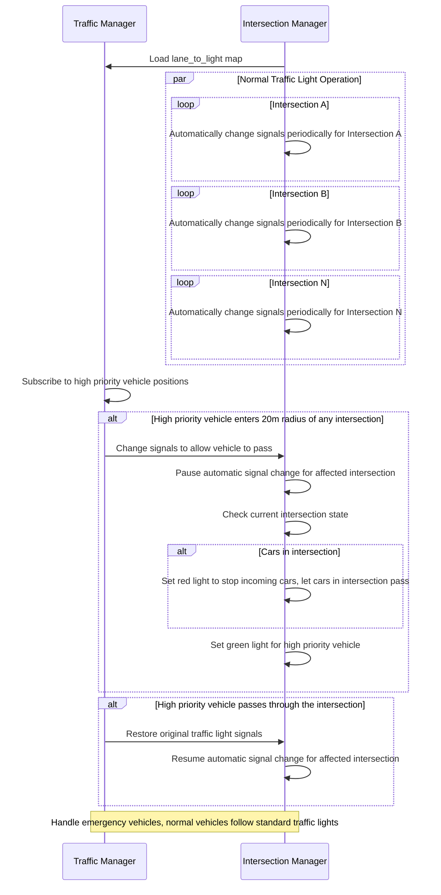

# Zenoh Autoware V2X

## Architecture


## Sequence Diagram



## Setup

> [!IMPORTANT]
> Please clone this repository under `autoware_carla_launch/external/` first.

- in Autoware container

```shell
cd autoware_carla_launch/external/zenoh_autoware_v2x
colcon build --symlink-install
```

## Run

- Run Carla simulator (In native host)

```shell
./CarlaUE4.sh -quality-level=Epic -world-port=2000 -RenderOffScreen -prefernvidia
```

- in bridge container

```shell
cd autoware_carla_launch
source env.sh
./script/run-bridge-v2x.sh
```

- in Autoware container

```shell
cd autoware_carla_launch
source env.sh
./script/run-autoware.sh

# Open another window in the Autoware container to execute the commands below.
source external/zenoh_autoware_v2x/install/setup.bash
ros2 run v2x_light v2x_light -- -v <vehicle_ID>
```

**Note:** <vehicle_id> must same as CARLA agent's rolename. (default is "v1")

## For Developers

You can use pre-commit and Ruff to have correct Python format

```shell
python3 -m pip install pre-commit ruff
pre-commit install --install-hooks
```
