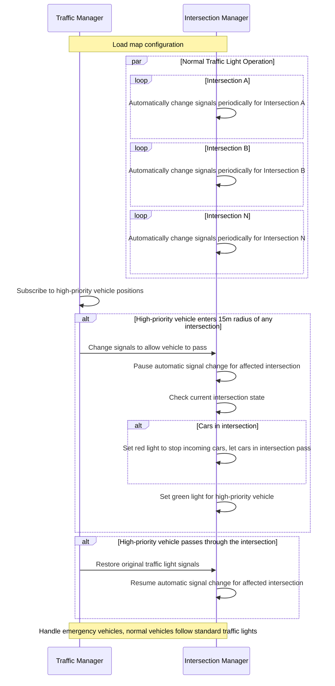

# Zenoh Autoware V2X

## Architecture


## Sequence Diagram



## Setup

> **Important:** Please clone this repository under `autoware_carla_launch/external/` first.

- In Autoware container

```shell
# Build the package inside the Autoware container
cd autoware_carla_launch/external/zenoh_autoware_v2x
colcon build --symlink-install
```

## Run

- Run the Carla simulator (On the native host)

```shell
./CarlaUE4.sh -quality-level=Epic -world-port=2000 -RenderOffScreen -prefernvidia
```

- In bridge container

```shell
# Run zenoh_carla_bridge, Python Agent and V2X module
cd autoware_carla_launch
source env.sh
./script/run-bridge-v2x.sh
```

- In Autoware container

```shell
# Run zenoh-bridge-ros2dds and Autoware
cd autoware_carla_launch
source env.sh
./script/run-autoware.sh

# Open another window in the Autoware container to execute the commands below.
source external/zenoh_autoware_v2x/install/setup.bash
ros2 run v2x_light v2x_light -- -v <vehicle_ID>
```

**Note:** <vehicle_ID> must match the CARLA agent's role name. (default is "v1")

## Map Information (`map_info.json`)

The `map_info.json` file defines the mapping between intersections and traffic lights in the V2X system. Its structure is as follows:

- **`intersections`**: Contains multiple intersections, each identified by a unique key (e.g., "A", "B", "C").
- Each intersection includes traffic lights that influence each other’s traffic flow, meaning that simultaneous green lights could create conflicts.
  - **`autoware_lane`**: Corresponding lane ID in Autoware.
  - **`autoware_traffic_light`**: Traffic light ID in Autoware.
  - **`carla_traffic_light`**: Traffic light ID in the CARLA simulator.
  - **`traffic_light_position`**:
    - The traffic light's position in Autoware's coordinate system (`x, y`).
    - **Coordinate system transformation**:
      - The x-axis in Autoware and CARLA are the same.
      - The y-axis in Autoware is the inverse of CARLA’s y-axis (`Autoware_y = -CARLA_y`).
    - **Note**: Since CARLA provides more precise traffic light coordinates, this field in `map_info.json` is extracted from CARLA and then converted to Autoware’s coordinate system.

### Generating `map_info.json`

- **`autoware_lane` / `autoware_traffic_light`**:
  - The `lanelet2_map.osm` file can be imported into [Tier IV Vector Map Builder](https://tools.tier4.jp/feature/vector_map_builder_ll2/) to obtain lane IDs and traffic light IDs.
  - In **Autoware version 20240903**, traffic light IDs can also be identified from the RViz-rendered map.

- **`carla_traffic_light`**:
  - Can be retrieved using the CARLA API which will return a list of traffic light actors.

- **`traffic_light_position`**:
  - The position of traffic lights can be obtained using the CARLA API.
    The Carla coordinate y-axis value should be negated to match Autoware’s coordinate system.
  - Alternatively, positions can also be extracted from the `lanelet2_map.osm` file.

The `map_info.json` file is loaded during the initialization of the **Traffic Manager** and **Intersection Manager**.

## For Developers

You can use pre-commit and Ruff to have correct Python format

```shell
python3 -m pip install pre-commit ruff
pre-commit install --install-hooks
```
